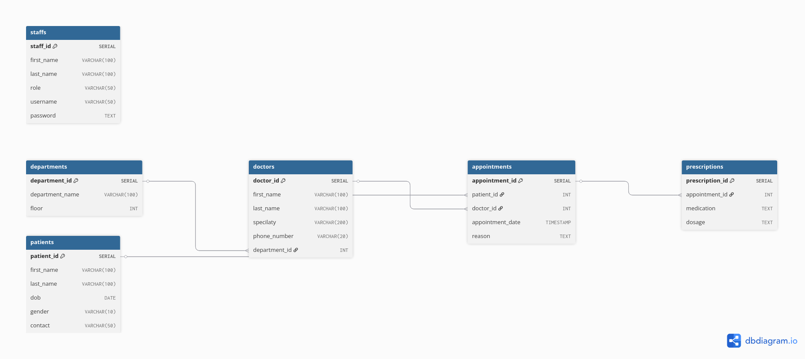

# 🏥 Hospital Database Project

This is a PostgreSQL-based hospital database project designed and managed by **Gibson Nwagboniwe**, a BSc IT and MSc Computer Science graduate. The project demonstrates practical DBA skills, including schema design, data population, backup automation, and ER modeling.

---

## 🚀 Project Overview

The database supports a fictional hospital system with key entities like:

- Departments
- Patients
- Doctors
- Staffs
- Appointments
- Prescriptions

It features normalized table structures, foreign key relationships, and sample data to allow realistic querying and backup operations.

---

## 🛠️ Technologies Used

- **PostgreSQL 16+**
- **Ubuntu 24.04 LTS** (via VMware)
- **VS Code**
- **Bash scripting**
- **Git + GitHub**
- **[dbdiagram.io](https://dbdiagram.io)** (for ERD design)

---

## 📁 Project Structure

```bash
hospital-db-project/
├── schema/
│   ├── create_tables.sql      # SQL script to create all tables
│   └── insert_sample_data.sql        # SQL script with 20 rows of realistic sample data
├── backup_restore/
│   └── backup_script.sh       # Shell script to back up the PostgreSQL database
├── docs/
│   └── hospital-db.dbml       # DBML file for dbdiagram.io (ER diagram definition)
├── screenshots/
│   └── hospital-db-er-diagram.png  # Exported PNG of the ER diagram
└── README.md                  # Project documentation
```

---

## 📊 ER Diagram

Visual representation of the entire schema:



---

## 💾 How to Use This Project

### 1. Create the Schema

From the PostgreSQL interactive shell (`psql`):

```sql
\i schema/create_tables.sql
```

### 2. Insert Sample Data

```sql
\i schema/insert_sample_data.sql
```

### 3. Run a Backup

```bash
cd backup_restore
./backup_script.sh
```

This will create a timestamped backup in a `backups/` folder.

---

## 🧪 Example Queries

```sql
-- List all upcoming appointments
SELECT a.appointment_date, d.first_name, d.last_name AS doctor, p.first_name, p.last_name AS patient
FROM appointments a
JOIN doctors d ON a.doctor_id = d.doctor_id
JOIN patients p ON a.patient_id = p.patient_id
ORDER BY a.appointment_date;

-- List all prescriptions for a given patient
SELECT pr.medication, pr.dosage, ap.appointment_date
FROM prescriptions pr
JOIN appointments ap ON pr.appointment_id = ap.appointment_id
JOIN patients pa ON ap.patient_id = pa.patient_id
WHERE pa.first_name = 'Alice' AND pa.last_name = 'Johnson';
```

---

## ✅ Features Demonstrated

- ✅ Normalized relational database design
- ✅ Use of foreign key constraints
- ✅ Sample data population for test queries
- ✅ Backup automation using Bash
- ✅ Visual ER diagram creation and export

---

## 👤 Author

**Gibson Nwagboniwe**  
📧 nwagboniwegibson35@gmail.com  
🎓 MSc in Computer Science | BSc in IT  
🌐 GitHub: [DBA-GibsonN](https://github.com/DBA-GibsonN)

---

## 📌 Future Enhancements

- Add views and stored procedures
- Integrate test automation for query validation
- Containerize the DB using Docker

---

> ✅ This project is designed to showcase database administration and design skills. Feel free to fork, contribute, or provide feedback!